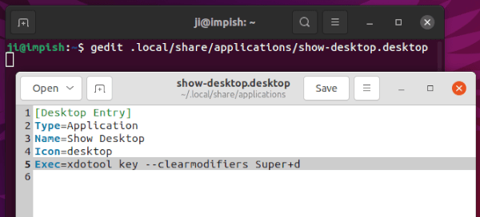
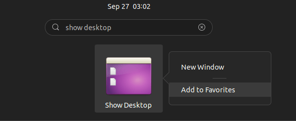
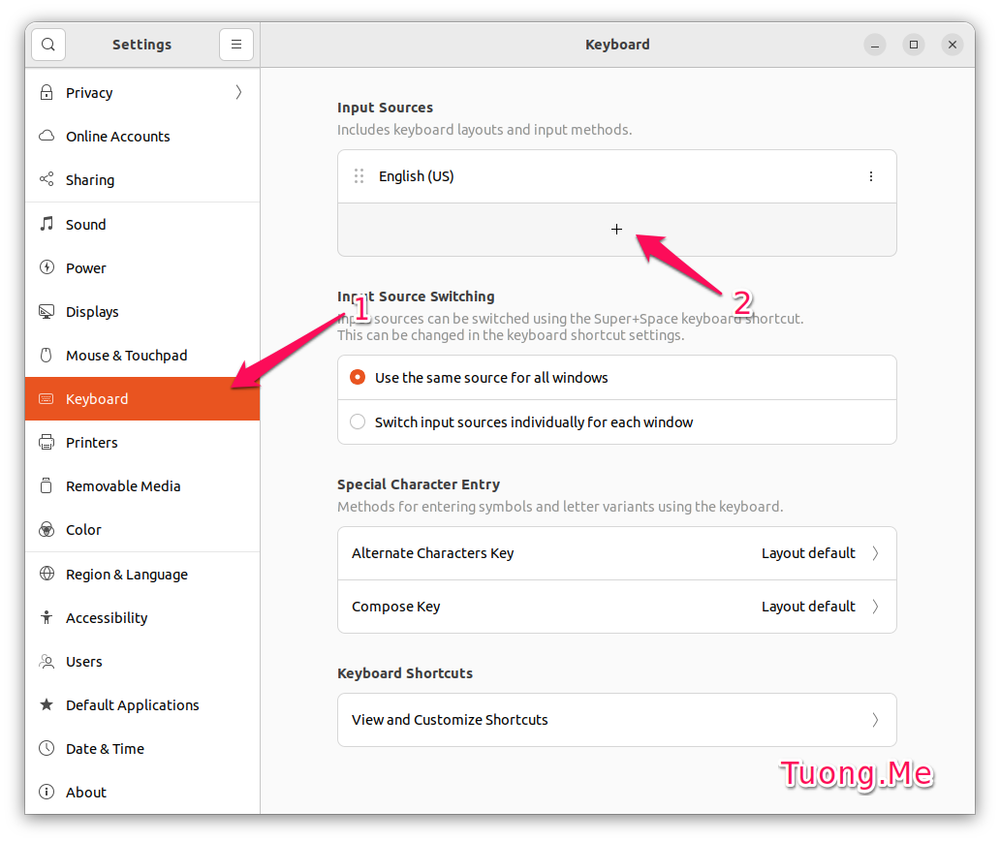
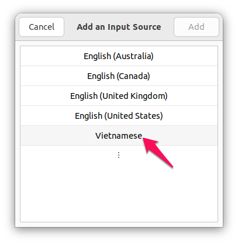
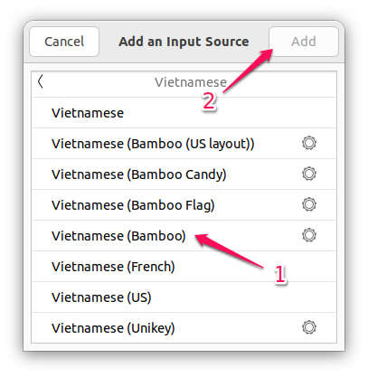
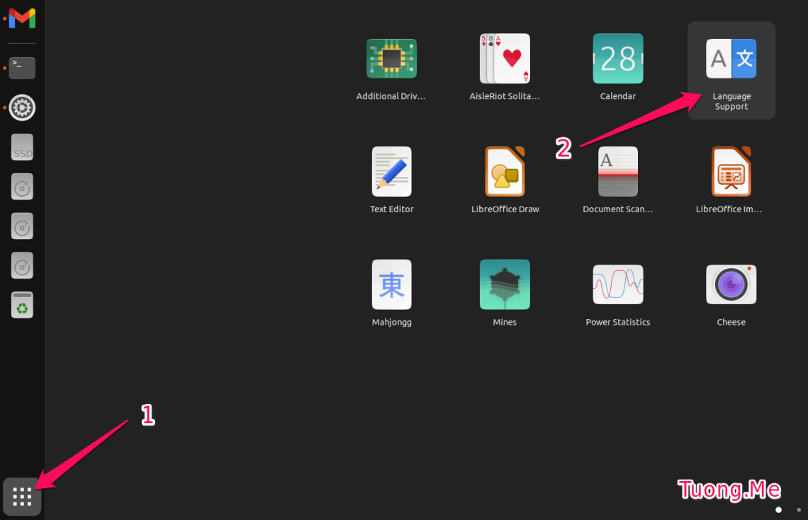
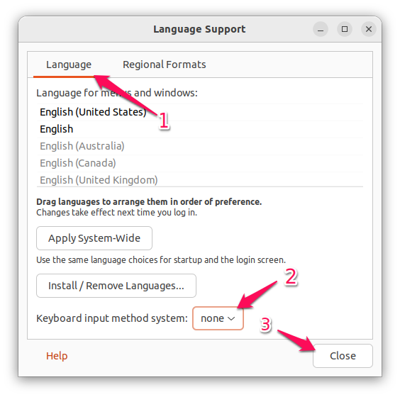

# Cài đặt Ubuntu

## I. Link tải xuống Ubuntu

- [Trên trang chủ](https://ubuntu.com/download)

## II. Cài đặt drivers

```bash
sudo ubuntu-drivers autoinstall
sudo apt update
sudo apt upgrade
```

### Cài đặt NVIDIA Driver

- [CUDA Toolkit](https://developer.nvidia.com/cuda-11-8-0-download-archive?target_os=Linux&target_arch=x86_64&Distribution=Ubuntu&target_version=22.04&target_type=runfile_local)
- [NVIDIA cuDNN](https://developer.nvidia.com/rdp/cudnn-archive)

## III. Cài đặt phần mềm

### 1. Cài đặt các phần mềm thường dùng và trình biên dịch

- [Snap Store](https://snapcraft.io)

```bash
killall snap-store
sudo snap refresh
```

- [FFMPEG Thumbnailer](https://apps.kde.org/ffmpegthumbs/)

```bash
sudo apt install ffmpegthumbnailer -y
sudo apt update
sudo rm /usr/share/thumbnailers/totem.thumbnailer
```

- [Google Chrome](https://www.google.com/intl/vi/chrome/)
- [Microsoft Edge](https://www.microsoft.com/vi-vn/edge/download)
- [WPS Office](https://www.wps.com/download/)

```bash
sudo snap install wps-2019-snap
git clone https://github.com/IamDH4/ttf-wps-fonts.git
cd ttf-wps-fonts
sudo sh install.sh
cd ..
rm -rf ttf-wps-fonts
```

- [Vs Code](https://code.visualstudio.com/Download)

```bash
wget -qO- https://raw.githubusercontent.com/cra0zy/code-nautilus/master/install.sh | bash
```

- [Git](https://git-scm.com/download/linux)

```bash
sudo apt update && sudo apt upgrade
sudo apt-get install git -y
git config --global user.name "Vu Xuan Hoang"
git config --global user.email vuxuanhoang000@gmail.com
```

- [Telegram](https://desktop.telegram.org/)

```bash
sudo apt update && sudo apt upgrade
sudo apt install telegram-desktop -y
```

- [OBS Studio](https://obsproject.com/download#linux)

```bash
sudo add-apt-repository ppa:obsproject/obs-studio
sudo apt update
sudo apt install ffmpeg obs-studio -y
```

- [VLC Media Player](https://www.videolan.org/vlc/download-ubuntu.html)

```bash
sudo snap install vlc
```

- [GCC &amp; G++](https://sourceforge.net/projects/mingw-w64/files/)

```bash
sudo apt install build-essential -y
```

- [Java](https://www.oracle.com/vn/java/technologies/downloads/)

```bash
sudo apt install openjdk-17-jre-headless -y
sudo apt install openjdk-17-jdk-headless -y
java -version
javac -version
```

- [Python](https://www.python.org/downloads/)

```bash
sudo apt install python3 -y
sudo apt install python3-pip -y
sudo apt install python3-venv -y
```

or

```bash
sudo apt update
sudo apt install build-essential zlib1g-dev libncurses5-dev libgdbm-dev libnss3-dev libssl-dev libreadline-dev libffi-dev libsqlite3-dev wget libbz2-dev -y
cd ~/Downloads
wget https://www.python.org/ftp/python/3.10.10/Python-3.10.10.tgz
tar -xf Python-3.10.10.tgz
cd Python-3.10.10
./configure --enable-optimizations
make -j 4 # hãy sửa đổi -j để tương ứng với số lượng lõi trong bộ xử lý của bạn. Bạn có thể tìm số bằng cách gõ nproc.
sudo make altinstall
python3.10 --version
```

- [NodeJs](https://nodejs.org/)

```bash
sudo apt install curl -y
curl -sL https://deb.nodesource.com/setup_18.x | sudo -E bash -
sudo apt update
sudo apt install nodejs -y
node --version
npm --version
```

- [MySql](https://www.mysql.com/)

```bash
sudo apt install mysql-server -y
mysql --version
systemctl is-active mysql
sudo mysql
```

```sql
UNINSTALL COMPONENT 'file://component_validate_password';
ALTER USER 'root'@'localhost' IDENTIFIED WITH mysql_native_password BY '123';
exit;
```

```bash
sudo mysql -u root --password=123
```

```sql
show databases;
create database testDB;
show databases;
exit;
```

```bash
systemctl status mysql.service
```

### 2. Thêm Show-Desktop Shortcut

```bash
sudo apt-get install xdotool -y
gedit ~/.local/share/applications/show-desktop.desktop
```

```plaintext
[Desktop Entry]
Type=Application
Name=Show Desktop
Icon=desktop
Exec=xdotool key --clearmodifiers Super+d
```



-> Tìm kiếm `Show Desktop`



### 3. Cài bộ gõ tiếng việt Ibus-Bamboo

```bash
sudo add-apt-repository ppa:bamboo-engine/ibus-bamboo
sudo apt-get update
sudo apt-get install ibus-bamboo
ibus restart
```

- Vào `Settings` -> `Keyboard` nhấn vào dấu `+` trong phần `Input Sources` như hình.



- Một cửa sổ nhỏ hiện ra các bạn nhấn chọn vào `Vietnamese`.



- Chọn vào mục `Vietnamese (Unikey)` rồi nhấn `Add` để thêm bộ gõ tiếng Việt cho Ubuntu.



- Nếu bạn không tìm thấy `Vietnamese (Unikey)` trong danh sách thì hãy khởi động lại máy tính và thử lại.
- Tiếp theo nhấn chọn vào `Show Applications` và chạy ứng dụng `Language Support`.



- Trong giao diện công cụ này, ở tab `Language` tìm đến `Keyboard input method system` và chuyển giá trị từ `Ibus` sang `none`.



- Bây giờ ở trên góc trên cùng bên phải có biểu tượng để chuyển giữa `en` và `vi` thì lúc này ta đã cài `unikey` cho Ubuntu thành công. Bước tiếp theo bạn chỉ cần thay đổi bộ gõ sang `Vietnamese (Unikey)` để sử dụng.
