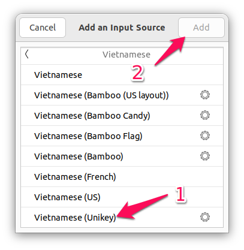

# Cài đặt Ubuntu

## I. Link tải xuống Ubuntu

-   [Trên trang chủ](https://ubuntu.com/download)

## II. Cài đặt drivers

```bash
sudo ubuntu-drivers autoinstall
sudo apt update
sudo apt upgrade
```

### Cài đặt NVIDIA Driver

-   [CUDA Toolkit](https://developer.nvidia.com/cuda-downloads)
-   [NVIDIA cuDNN](https://developer.nvidia.com/rdp/cudnn-archive)

## III. Cài đặt phần mềm

### 1. Cài đặt các phần mềm thường dùng và trình biên dịch

-   [FFMPEG Thumbnailer](https://apps.kde.org/ffmpegthumbs/)

```bash
sudo apt install ffmpegthumbnailer -y
sudo apt update
sudo rm /usr/share/thumbnailers/totem.thumbnailer
```

-   [Google Chrome](https://www.google.com/intl/vi/chrome/)
-   [Microsoft Edge](https://www.microsoft.com/vi-vn/edge/download)
-   [WPS Office](https://www.wps.com/download/)
-   [Vs Code](https://code.visualstudio.com/Download)

```bash
wget -qO- https://raw.githubusercontent.com/cra0zy/code-nautilus/master/install.sh | bash
```

-   [Git](https://git-scm.com/download/linux)

```bash
sudo apt update && sudo apt upgrade
sudo apt-get install git -y
git config --global user.name "Vu Xuan Hoang"
git config --global user.email vuxuanhoang000@gmail.com
```

-   [Telegram](https://desktop.telegram.org/)

```bash
sudo apt update && sudo apt upgrade
sudo apt install telegram-desktop -y
```

-   [OBS Studio](https://obsproject.com/download#linux)

```bash
sudo add-apt-repository ppa:obsproject/obs-studio
sudo apt update
sudo apt install ffmpeg obs-studio -y
```

-   [VLC Media Player](https://www.videolan.org/vlc/download-ubuntu.html)

```bash
sudo snap install vlc
```

-   [GCC & G++](https://sourceforge.net/projects/mingw-w64/files/)

```bash
sudo apt install build-essential -y
```

-   [Java](https://www.oracle.com/vn/java/technologies/downloads/)

```bash
sudo apt install openjdk-17-jre-headless -y
sudo apt install openjdk-17-jdk-headless -y
java -version
javac -version
```

-   [Python](https://www.python.org/downloads/)

```bash
sudo apt install python3 -y
sudo apt install python3-pip -y
sudo apt install python3-venv -y
```

-   [NodeJs](https://nodejs.org/)

```bash
sudo apt install curl -y
curl -sL https://deb.nodesource.com/setup_18.x | sudo -E bash -
sudo apt update
sudo apt install nodejs -y
node --version
npm --version
```

-   [MySql]()

```bash
sudo apt install mysql-server -y
mysql --version
sudo mysql_secure_installation
sudo mysql -u root
```

```sql
show databases;
create database first-mysql-database;
show database;
```

### 2. Cài bộ gõ tiếng việt Ibus-Unikey

```bash
sudo apt-get install ibus-unikey -y
sudo reboot
```

-   Vào `Settings` -> `Keyboard` nhấn vào dấu `+` trong phần `Input Sources` như hình.


-   Một cửa sổ nhỏ hiện ra các bạn nhấn chọn vào `Vietnamese`.


-   Chọn vào mục `Vietnamese (Unikey)` rồi nhấn `Add` để thêm bộ gõ tiếng Việt cho Ubuntu.



-   Nếu bạn không tìm thấy `Vietnamese (Unikey)` trong danh sách thì hãy khởi động lại máy tính và thử lại.

-   Tiếp theo nhấn chọn vào `Show Applications` và chạy ứng dụng `Language Support`.


-   Trong giao diện công cụ này, ở tab `Language` tìm đến `Keyboard input method system` và chuyển giá trị từ `Ibus` sang `none`.


-   Bây giờ ở trên góc trên cùng bên phải có biểu tượng để chuyển giữa `en` và `vi` thì lúc này ta đã cài `unikey` cho Ubuntu thành công. Bước tiếp theo bạn chỉ cần thay đổi bộ gõ sang `Vietnamese (Unikey)` để sử dụng.
